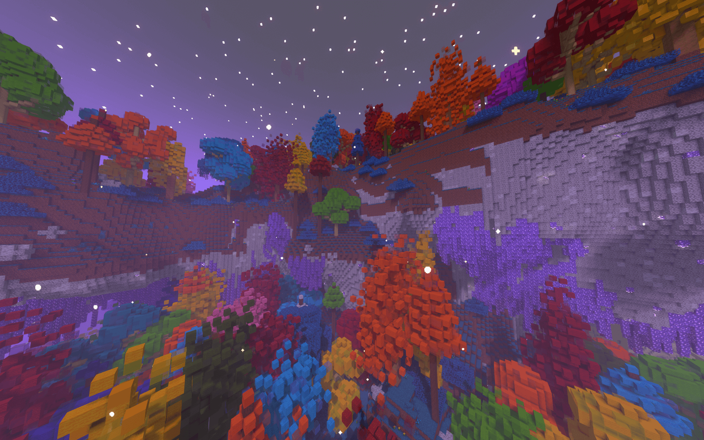

> :tada:{ .mirror } ***DEDICATED CONTENT*** :tada:
>
> This feature is dedicated to kohara (*Developer*)

**The Hallow** is an exceptionally rare [biome](index.md) found in The End. It is themed around light and magic, seen by having lots of lights and quite a lot of colors compared to other less vibrant biomes of The End.

It is based on [The Hallow](https://terraria.wiki.gg/wiki/The_Hallow "'The Hallow' on Terraria wiki") biome from [Terraria](https://terraria.wiki.gg/wiki/Terraria ).

  { align=left #kohara-infobox--image}

  <table id="kohara-infobox" >
	<tr>
		<th colspan="2">Info</th>
	</tr>
	<tr>
		<td><b>ID</b></td>
		<td style="text-align: center;"><code>stellarity:the_hallow</code></td>
	</tr>
	<tr>
		<td><b>Category</b></td>
		<td style="text-align: center;">Lush</td>
	</tr>
	<tr>
		<td><b>Temperature</b></td>
		<td style="text-align: center;">0.7</td>
	</tr>
	<tr>
		<td><b>Structures</b></td>
		<td style="text-align: center;">End Cities, End Villages</td>
	</tr>
	<tr>
		<th colspan="2">Colors</th>
	</tr>
	<tr>
		<td><b>Grass</b></td>
		<td style="text-align: center;"> #4EC1E3</td>
	</tr>
	<tr>
		<td><b>Foliage</b></td>
		<td style="text-align: center;"> #4FA3E3</td>
	</tr>
	<tr>
		<td><b>Water</b></td>
		<td style="text-align: center;"> #F937ED</td>
	</tr>
	<tr>
		<td><b>Water Fog</b></td>
		<td style="text-align: center;"> #C639F9</td>
	</tr>
</table>

## Description
Hallow is densely packed with vegetation, with domination of tall rainbow trees. The only mobs that spawn here are the [Allays](https://minecraft.fandom.com/wiki/Allay) and passive [Pixies](../mobs/pixie.md), making it one of the safest biomes in the entire pack. End Stone is replaced with Diorite and Calcite, and large Amethyst Crystals are growing from beneath the cliffs. 

Grass found here is blue, and Water has a magenta tint.

The biome tends to generate on hilly, continental terrain, although it rarely generates on forms of terrain that are a bit more shattered.

It is one of a few biomes where [End Villages](../structures/end_village.md) can be found. Apart from that, [End Cities](../structures/end_city.md) generate here as well, with Chests in the Ships having a small chance to contain <i class="icon-stellarity icon-stellarity-duskberry"></i>[Dusbkerries](../items/trinkets/duskberry.md).

## Music
Apart from regular End music, these tracks play when the player is in The Hallow specifically.

| Filename | Soundtrack title | Soundtrack | Author | Track |
| :--- | :--- | :--- | :--- | :--- |
| `music/game/swamp/aerie` | Aerie | Minecraft: Wild Update OST | Lena Raine | <audio controls controlslist="nodownload noplaybackrate" src="../../assets/audio/music/aerie.ogg" type="audio/ogg"></audio> |
| `music/game/swamp/firebugs` | Firebugs | Minecraft: Wild Update OST | Lena Raine | <audio controls controlslist="nodownload noplaybackrate" src="../../assets/audio/music/firebugs.ogg" type="audio/ogg"></audio> |
| `music/game/creative/creative4` | Aria Math | Minecraft - Volume Beta | C418 | <audio controls controlslist="nodownload noplaybackrate" src="../../assets/audio/music/creative4.ogg" type="audio/ogg"></audio> |
| `music/game/hal3` | Haggstrom | Minecraft - Volume Alpha | C418 | <audio controls controlslist="nodownload noplaybackrate" src="../../assets/audio/music/hal3.ogg" type="audio/ogg"></audio> |
| `music/game/piano3` | Mice on Venus | Minecraft - Volume Alpha | C418 | <audio controls controlslist="nodownload noplaybackrate" src="../../assets/audio/music/piano3.ogg" type="audio/ogg"></audio> |

## Ambiance
| Name | Sound | Group |
| :--- | :--- | :--- |
| TBA | TBA | TBA |

## Trivia

- So far it is the only dedicated biome in Stellarity.
- It is the only biome to have only passive mobs spawning.
- The Hallow was the first biome to get a boss based around it.
- Music that plays while inside this biome are all kohara's most favorite tracks from the main game.
- The verb 'to hallow' means 'to make holy'.
- The description of its special Advancement is a reference to what Painter NPC says about The Hallow in Terraria upon interacting with him in Hardmode.

## History

-  **2.0a**
    - Reduced number of Large Amethyst Stalactites.
    - Pixie Dust can now be used to craft [Prismatic Punch](../items/prismatic_punch.md) and [Sariel](../items/sariel.md).
    - Added Empress of Light - a boss themed around this biome.
    - Fixed abnormal amounts of [Pixies](../mobs/pixie.md) spawning all over The Hallow.
    - Allays can rarely replace Pixies on spawn.
* **1.5b**
    - Added [Pixies](../mobs/pixie.md), they served no purpose other than ambience or aquiring [<i class="icon-stellarity icon-stellarity-pixie-dust"></i>[Pixie Dust](../items/other/pixie_dust.md).
* **1.5a**
    - [Hallowed Crate](../mechanics/void_fishing.md#crates), [Mystical Heartfish](../mechanics/void_fishing.md#fish) and [Prismite](../mechanics/void_fishing.md#fish)) can now be caught while [Void Fishing](../mechanics/void_fishing.md) in The Hallow.
* **1.4a**
    - Changed generation requirements once more.
* **1.3a**
    - Slightly tweaked Hallow's generation requirements.
* **1.2a**
    - Introduced
