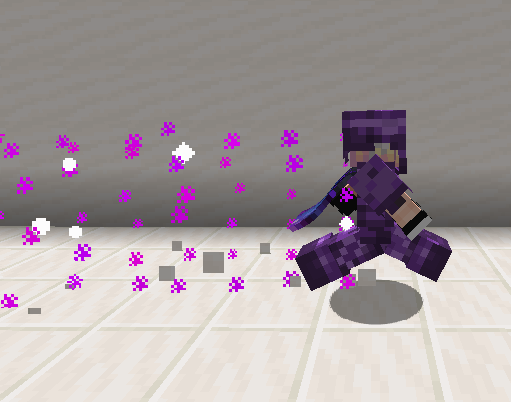

# Ancient Armor

**Ancient Armor** is a post-Dragon armor set crafted with [Ancient Plating](../materials/ancient_plating.md). It is oriented around offense.

Wearing a full set of Ancient Armor grants player a set bonus, which increases damage on consecutive attacks up to 5 times.

  

[TOC]

	<table id="kohara-infobox--item">
		<tr>
			<th colspan="2" class="kohara-infobox--top-image"></th>
		</tr>
		<tr>
			<th colspan="2">Info</th>
		</tr>
		<tr>
			<td><b>Total Defense</b></td>
			<td>20</td>
		</tr>
		<tr>
			<td><b>Total Armor Toughness</b></td>
			<td>12</td>
		</tr>
		<tr>
			<td><b>Total Other Bonuses</b></td>
			<td>
				+15% Attack Speed
				 
				+10% Damage
				 
				+20% Knockback Resistance
			</td>
		</tr>
		<tr>
			<td><b>Full Set Bonus</b></td>
			<td>
			Fills you with Wrath of The Ancients,
			 
			providing ramping increasing damage on combo attacks!
			</td>
		</tr>
	</table>

## Obtaining
Pieces of Ancient Armor have a 33% chance to generate in any Chest found inside [End Cities](../../structures/end_city.md), except for the ones on Ships. It has an additional 36% chance to have random enchantments.

Each piece of Ancient Armor can also be crafted at the [Altar of The Accursed](../../mechanics/altar_of_the_accursed.md), using 4/8/7/5 [Ancient Plating](../materials/ancient_plating.md).

## Set Bonus
While wearing a full set of Ancient Armor, players gain the ability to increase damage on consecutive attacks. Hitting an enemy increases the damage of the next attack by 5%. This stacks up to 5 times for a grand total of 25% extra damage. This boost lasts for 5 seconds before vanishing, unless another attack has hit a mob.

The set bonus extra damage stacks with the 10% extra damage from all armor pieces, meaning the actual damage increase is 35%.

The amount of damage stacks a player has is indicated by differently pitched hit sounds, with higher pitch being equal to higher damage multiplier.

Additionally, running with a full set of Ancient Armor will produce a purely cosmetic purple trail.
<figure markdown>
  { align=right width="300vw" .border }
  <figcaption>Ancient Armor trail seen while running</figcaption>
</figure>

## Tips
- This armor set pairs extremely well with really any weapon. The increased attack speed on top of extraordinary damage boosts is enough to make even a Wooden Sword an extremely deadly weapon.
- The damage and attack speed bonuses stack with the ones of the [Duskberry](../trinkets/duskberry.md), which makes for a destructive build.

## Trivia
- <i class="icon-stellarity icon-stellarity-ancient-armor"></i>Ancient Armor, <i class="icon-stellarity icon-stellarity-hallowed-armor"></i>[Hallowed Armor](hallowed_armor.md) and <i class="icon-stellarity icon-stellarity-living-flesh"></i>[Living Flesh](../trinkets/living_flesh.md) were the first items to have ever been added into Stellarity.
    - The first ever items to be added are [Treasure Heads](../../mechanics/treasure_heads.md)
    - While it got added as far back as v1.3a, <i class="icon-stellarity icon-stellarity-living-flesh"></i>Living Flesh had no use before v1.5a.
        - It was officialy removed as of vIndev-1.6a.
- Prior to v1.5a, this armor set was known as <i class="icon-minecraft icon-minecraft-diamond-chestplate"></i>`Ancient Diamond Armor`.
    - It also used to have random stats. It could provide a random amount of Defense, Attack Speed, Attack Knockback and Movement Speed.
        - Due to how Attack Knockback works in Minecraft, it didn't increase anything.
        - Movement Speed increase was so huge that players could trigger vanilla anti-cheat in Singleplayer while wearing 2 or more armor pieces.
- Prior to v2.0a:
	1. It used to have a different set bonus, which was just a flat 50% damage increase.
	2. Ancient Leggings used to have Diamond Leggings as base item instead of Leather Pants.
- Ancient Armor's set bonus is based on Nyx[^1] kit from Roblox BedWars[^2].
- kohara has a special particle trail, being made of Cherry Leaves particles instead of 

## History
=== "**v2.0a**"
    - Increased combo duration (3s -> 5s).
    - No longer found in End Cities, being directly replaced by Ancient Plating.

=== "**vIndev-1.6a**"
	- Fixed Ancient Leggings being a piece of Diamond Armor.
	- Now has a custom texture.
	- Damage boost from Armor pieces reduced *(+20% -> +10%)*.
	- Armor Toughness per-piece increased to match Netherite Armor.
	- Only Ancient Scalemail grants Attack Speed bonus. Bonus decreased *(+60% -> + 15%)*.
	- Nerfed quality of enchantments of armor pieces found in Chests.
	- Chests in End Cities have a 50 - 66% chance to contain an Armor piece, of which there is a 50/50 chance it is going to be a piece of Ancient Armor. Previously, it would be an Ancient Armor piece 3/4 of the time.
	- Set bonus reworked. It now provides an increasing damage bonus on melee attacks *(+5% per hit, stacks for up to 25%)* which quickly decays while out of combat. Total max damage bonus is now 35% *(down from 80%)*.
	- Can no longer be found in Crates fished out via Void Fishing, instead can be crafted with ingredients found inside.
	- Set bonus trail now shows only while running, instead of while moving in general.

=== "**v1.5a**"
	- Reworked the entire set. It no longer has randomized stats and instead focuses on increasing offensive capabilites.
	- Added a full set bonus.
	- Turned into a dyed Leather Armor with custom durability, instead of using Diamond Armor.
	- Added a trail while moving around with full set.

=== "**1.3a**"
	- Introduced.

[^1]: [Nyx](https://robloxbedwars.fandom.com/wiki/Nyx) kit on Roblox Bedwars Wiki
[^2]: [Roblox BedWars](https://www.roblox.com/games/6872265039/)
