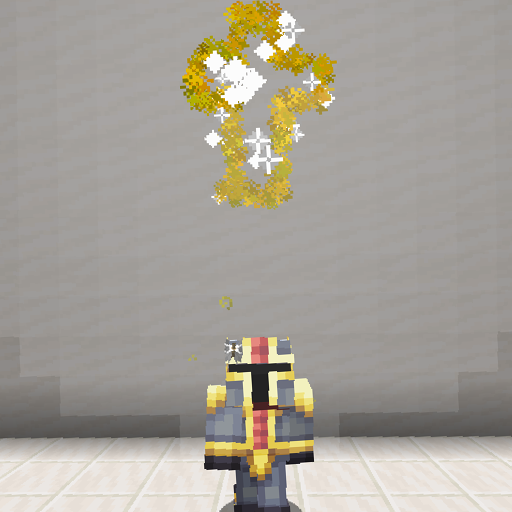

# Hallowed Armor

**Hallowed Armor** is a post-Dragon armor set crafted with [Hallowed Ingots](../materials/hallowed_ingot.md). It is oriented around mobility.

Wearing a full set of Hallowed Armor grants a set bonus, which allows for dodging of attacks with a cooldown.

  

[TOC]

  	<table id="kohara-infobox--item">
		<tr>
			<th colspan="2" class="kohara-infobox--top-image"></th>
		</tr>
		<tr>
			<th colspan="2">Info</th>
		</tr>
		<tr>
			<td><b>Total Defense</b></td>
			<td>20</td>
		</tr>
		<tr>
			<td><b>Total Armor Toughness</b></td>
			<td>12</td>
		</tr>
		<tr>
			<td><b>Total Other Bonuses</b></td>
			<td>
				+10% Movement Speed
				 
				+20% Knockback Resistance
			</td>
		</tr>
		<tr>
			<td><b>Full Set Bonus</b></td>
			<td>Grants the ability to dodge attacks,
			 
			nullifying all damage and knockback</td>
		</tr>
	</table>

## Obtaining
Pieces of Hallowed Armor have a 33% chance to generate in any Chest found inside [End Cities](../../structures/end_city.md), except for the ones on Ships. It has an additional 36% chance to have random enchantments.

Each piece of Hallowed Armor can also be crafted at the [Altar of The Accursed](../../mechanics/altar_of_the_accursed.md), using 4/8/7/5 [Hallowed Ingots](../materials/hallowed_ingot.md).

## Set Bonus
Equipping full set of Hallowed armor will start a 20 seconds countdown. After reaching 0, player will get a buff - **Holy Protection**. Upon taking <u>ANY</u> damage, Holy Protection will set all incoming damage to 0 for next 5 seconds, as well as making player immune to all forms of knockback. Additionally, player will get Fire Protection and Water Breathing for next 8 seconds, as well as a short boost to Movement Speed that decays over timespan of 6 seconds.

This dodge has a cooldown of another 16 seconds. The initial 20 seconds is reapplied only when player takes off Hallowed Armor.

<figure markdown>
  { align=right width="400vw" .border }
  <figcaption>Dodging an attack with Hallowed Armor</figcaption>
</figure>

## Tips
- This armor is incredibly versatile, as it can be paired with any weapon or trinket.
- Combining Hallowed Armor with [Duskberry](../trinkets/duskberry.md) and a Swiftness Potion is a fantastic strategy for the [Empress of Light](../../mobs/bosses/empress_of_light.md), making players able to outrun most of her attacks as well as providing them a second change if they fail to dodge them.

## Trivia
- <i class="icon-stellarity icon-stellarity-ancient-armor"></i>[Ancient Armor](ancient_armor.md), <i class="icon-stellarity icon-stellarity-hallowed-armor"></i>Hallowed Armor and <i class="icon-stellarity icon-stellarity-living-flesh"></i>[Living Flesh](../other/living_flesh.md) were the first items to have ever been added into Stellarity.
    - The first ever items to be added are [Treasure Heads](../../mechanics/treasure_heads.md)
    - While it got added as far back as v1.3a, <i class="icon-stellarity icon-stellarity-living-flesh"></i>Living Flesh had no use before v1.5a.
        - However, it was officialy removed as of vIndev-1.6a.
- Prior to v1.5a, this armor set was known as <i class="icon-minecraft icon-minecraft-diamond-chestplate"></i>`Hallowed Diamond Armor`.
    - It also used to have random stats. It could provide a random amount of Defense, Attack Speed, Armor Toughness and Movement Speed.
        - Movement Speed increase was so huge that players could trigger vanilla anti-cheat in Singleplayer while wearing 2 or more armor pieces.
        - Sometimes Armor Toughness would get listed twice due to some errors in loot tables. 
            - This has since been fixed.
- When resource pack is enabled, golden parts of Hallowed Armor produce a faint glow in the dark.
- During the development of vIndev-1.6a, Holy Protection used to timeout after 15 seconds without being damaged, although it was removed a few weeks later.
    - The official reason was because kohara couldn't stand the '`constant Holy Protection ON and OFF`' sounds.

## Advancements
| Icon | Title | Description | Parent | Actual requirements (if different) | Resource Location |
| :--- | :--- | :--- | :--- | :--- | :--- |
| 
<i class="adv adv-goal"></i><i class="icon-adv icon-stellarity icon-stellarity-hallowed-armor"></i>
 | Hallelujah! | Dodge an attack with a full set of Hallowed Armor | Cursed Crafting | :x: | `stellarity:aota/cancel_damage_hallowed_armor` |

## History
=== "**v2.0a**"
    - No longer found in End Cities, being directly replaced by Ancient Plating.
	- Increased dodge cooldown by 10% (20s -> 22s).
    - Hallowed Treads movement speed bonus reduced (+10% -> +8%) and is now additive instead of multiplicative.
=== "**vIndev-1.6a**"
	- Now has a custom texture.
	- Armor Toughness per-piece increased to match Netherite Armor.
	- Fixed Holy Protection cooldown being 3 - 4 seconds shorter than usual because of it going off right with invincibility.
	- Holy Protection duration increased (3 seconds -> 4 seconds).
	- Holy Protection Fire Resistance duration increased (3 seconds -> 7 seconds).
	- Holy Protection now also grants 7 seconds of Water Breathing.
	- Holy Protection Speed boost now lasts longer (4 -> 6 seconds) and diminishes over time.
	- Only Hallowed Treads now provide Movement Speed bonus (12% -> 10% boost).
	- Each Hallowed Armor piece no longer provides extra 7.5%:heart:HP.
	- Hallowed Chestplate now grants 20% reduced knockback.
	- Fixed Holy Protection invincibility being removable with <i class="icon-minecraft icon-minecraft-milk-bucket"></i>Milk.
	- Nerfed quality of enchantments of armor pieces found in Chests.
	- Chests in End Cities have a 50 - 66% chance to contain an Armor piece, of which there is a 50/50 chance it is going to be a piece of Hallowed Armor. Previously, it would be a Hallowed Armor piece 1/4 of the time.
	- Fixed Holy Protection being triggered even if damage is blocked with a Shield.
	- Can no longer be found in Crates fished out via Void Fishing, instead can be crafted with ingredients found inside.

=== "**v1.5a**"
	- Reworked the entire set. It no longer has randomized stats and instead grants the ability to nullify attacks.
	- Added a full set bonus.
	- Turned into a dyed Leather Armor with custom durability, instead of using Diamond Armor as base item.

=== "**v1.3a**"
	- Introduced.
  