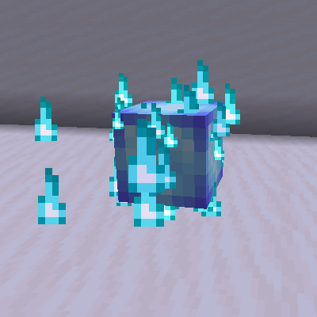

# Spirit Dagger

> :tada:{ .mirror } ***DEDICATED CONTENT*** :tada:
>
> This feature is dedicated to kohara (*Developer*)

**Spirit Dagger** is a special weapon with the ability to attract Spirits on attacks, which can be teleported to from a distance to gain a short attack buff.

It is intended to be a post-Dragon item, however obtaining it before killing the Ender Dragon is possible, though extremely tedious.

<i class="icon-minecraft icon-minecraft-enchanted-book"></i> Spirit Dagger can be enchanted with any Sword enchantment. Certain enchantments will have new effects.

<i class="icon-minecraft icon-minecraft-anvil"></i> Spirit Dagger can be repaired with <i class="icon-minecraft icon-minecraft-diamond"></i>Diamonds.

  

[TOC]

  <table id="kohara-infobox--item">
	<tr>
		<th colspan="2" class="kohara-infobox--top-image"></th>
	</tr>
	<tr>
		<th colspan="2">Info</th>
	</tr>
	<tr>
		<td><b>Damage</b></td>
		<td>5 (6 with both equipped)</td>
	</tr>
	<tr>
		<td><b>Attack Speed</b></td>
		<td>Very Fast (2.6)</td>
	</tr>
	<tr>
		<td><b>Tooltip</b></td>
		<td>
			Holding one attracts Spirits on slashes
			 
			Holding one in both left and right hand
			 
			allows you to consume said Spirits
			 
			to instantly teleport to them
			 
			and gain a short attack buff
			 
			Enchantments scale from both Daggers
			  
			<i>'yes, I like roblox, okay?'</i>
			 
			- Developer Item -
		</td>
	</tr>
	<tr>
		<td><b>Durability</b></td>
		<td>496</td>
	</tr>
	<tr>
		<td><b>Other</b></td>
		<td>+1 Damage (while in offhand)</td>
	</tr>
</table>

## Obtaining
Spirit Dagger has a 6.5% chance to drop from Phantoms **found anywhere in The End**. Looting enchantment increases the odds by 0.7% per level, for a maximum of 8.6% drop chance with Looting III.

## Usage

<figure class="kohara-side-image--right" markdown>
  { align=right width="200vw" .border }
  <figcaption>An attracted Spirit</figcaption>
</figure>

Damaging enemies while holding a Spirit Dagger in any hand has a 50% chance to attract a Spirit. If another Spirit Dagger is equipped in the other hand, players can teleport to the summoned Spirit by looking at it for 10 ticks (0.5 second). Only one Spirit can exist in a 4 block radius.

Teleporting to the Spirit creates a large area of effect slash which damages all enemies around it for 5:heart: x ₂.₅  damage with 100% [armor penetration](../mechanics/armor_penetration.md). Afterwards player receives a small combat buff -  4:yellow_heart::yellow_heart: points of Absorption, +3:heart: x ₁.₅ damage and +35% movement speed. Assasination buff lasts for 4 seconds. The slash attack has a radius of 3.8 blocks. Slashes receive 60% of melee damage bonuses (excluding Potions of Strength).

Hit mobs which __have attracted a Spirit__ won't be able to do it again for the next 22 seconds, indicated by a spray of particles above their head.

While in the offhand, Spirit Dagger provides a +1 damage to any weapon (including other Spirit Daggers).

### Enchantments
Certain enchantments empower Spirit Dagger's slash attack. Enchantment power scales from both Daggers, meaning that having Sweeping Edge III on one of them and Sweeping Edge II on the other one acts as Sweeping Edge V.

| Enchantment | Action |
| :--- | :--- |
| Sweeping Edge | Increases slash attack damage by 0.5/level. |
| Fire Aspect | Slash attack sets mobs on fire for 1.5s/level. Does not work on players in PvP. |
| Knockback | Increases knockback of the slash attack. Does not work on players in PvP. |
| Bane of Arthropods | Arthropods will have Slowness IV inflicted to them for `1` to `(1.5 + [level * 0.5])` seconds. Doesn't increase slash damage. |

## Tips
- Both the damage and speed bonuses stack with Potions of Strength and Swiftness respectively.
- Spirits can be attracted by ANY damage, including *(but not limited to)* other Swords, Crossbows, Bows, etc., for as long as you are holding a Spirit Dagger in any hand.
    - However, the damage dealt has to be higher than 3:heart: х ₁.₅. Anything lower will not attract any Spirits no matter what.
- Teleporting has a distance limit of <u><b>70 blocks</b></u>.
    - This makes this item great for quick long distance travels while exploring or crossing large gaps.
    - Spyglass comes in handy while trying to position your cursor over a Spirit, as you can switch to a Spirit Dagger right away once you align perfectly.
- To fully use this weapon you have to obtain 2 of them. Using a weapon enchanted with Looting III is heavily encouraged due to how uncommon Phantoms are in The End.
    - Despite the drop chance being on the lower side, this item can be easily obtained in great quantities by opening multiple [Pandora's Barrels](other/pandoras_barrel.md). Be careful though, as Pandora's Barrel also increases stats of spawned mobs.
- This item pairs extremely well with [Sharanga](sharanga.md), since Spectral Bolts are completely unaffected by gravity, meaning that it is easier to snipe targets from far away in order to potentially attract Spirits.

## Sounds
| Sound | Name | Description | Subtitle | Resource location |
| :--- | :--- | :--- | :--- | :--- |
| <audio controls src="../../assets/sounds/spirit_dagger/charge.ogg" style="max-width: 100%; width: 180px;"> | Teleport Prepare | Plays on the first tick of focusing over a Spirit. | :x: | `item.spirit_dagger.charge` |
| <audio controls src="../../assets/sounds/spirit_dagger/slash.ogg" style="max-width: 100%; width: 180px;"> | Teleport | Plays after teleporting. | :x: | `item.spirit_dagger.teleport` |
| <audio controls src="../../assets/sounds/spirit_dagger/kohara_charge.ogg" style="max-width: 100%; width: 180px;"> | kohara Teleport Prepare | Plays on the first tick of focusing over a Spirit if player's name is `kohara_`. | :x: | `item.spirit_dagger.charge_kohara` |
| <audio controls src="../../assets/sounds/spirit_dagger/kohara_slash.ogg" style="max-width: 100%; width: 180px;"> | kohara Teleport | Plays after teleporting if player's name is `kohara_`. | :x: | `item.spirit_dagger.slash_kohara` |

## Advancements
| Icon | Title | Description | Parent | Actual requirements (if different) | Rewards | Resource Location |
| :--- | :--- | :--- | :--- | :--- | :--- | :--- |
| 
<i class="adv adv-task"></i><i class="icon-adv icon-stellarity icon-stellarity-spirit-dagger"></i>
 | Spirit Assasin | Teleport over 60 blocks with a pair of Spirit Daggers | Remote Getaway | :x: | :x: | `stellarity:exploration/spirit_assasin` |

## Trivia
- This is the second Developer weapon to get added into Stellarity, the first being [Prismatic Punch](prismatic_punch.md).
    - Though Prismatic Punch lost its Developer Item status in v2.1a.
- This weapon is based on Spirit Daggers - a weapon used by Evelynn[^1] in Roblox BedWars[^2].
    - This is also a reference to the fact that kohara loves this game and plays it far more often than he codes.
- This item had a total of 3 different drop chances prior to official release.
    - It first started with 12.5% base chance with 2.5% Looting bonus, then 15%/+3.5% before being nerfed to 10%/+1%.
        - This wasn't the final change in its drop rate, as in v2.1a it was reduced to 6.5%+0.7%.
- Prior to official release of 2.0a, Spirits used to directly heal 4:heart::heart: HP instead of granting 4:yellow_heart::yellow_heart: Absorption like it does now. This change was made to further replicate how Evelynn kit works in Roblox Bedwars.
- Spirit Dagger holds the title of the most tweaked weapon before its official release in a stable version, having been tweaked countless times prior to its release in 2.0a.
    - Some of the changes haven't even been listed on changelog Discord channel.
- In the development log from January 27th 2023, Spirits were said have a light blue glowing outline, however this wasn't actually implemented until 7 months later during the development of v2.1a.
- In PvP, dying to AoE slash attack will result in one of a few custom death messages:
    - 1. `VICTIM had their spirit consumed by PLAYER`.
    - 2. `VICTIM was slashed in half by PLAYER`.
    - 3. `VICTIM was assasinated by PLAYER`.
- If player's name is `kohara_`, the trail for the teleport is going to spawn Cherry Petals alongisde its regular particles.

## History
=== "**v2.1a**"
	- Reduced base drop chance (10% -> 6.5%) and Looting bonus (+1% -> +0.7%).
	- Increased attack speed (2 -> 2.6).
	- Now immune to fire and lava.
	- Spirits now spawn directly in the place of attacked mobs instead of a random spot around them.
	- Increased focus time (7 ticks -> 10 ticks).
	- Decreased time it takes for focus timer to reset (3s -> 1.5s).
	- Greatly increased the hitbox of Spirits.
	- Increased movement speed bonus from the assasination buff (+20% -> +35%). 
	- Increased damage bonus from the assasination buff (+2 -> +3).
	- Halved absorbption amount from the assasination buff (+8 -> +4).
	- Reduced duration of the assasination buff (5s -> 4s).
	- Increased Spirit attraction cooldown (19s -> 22s).
	- Increased base slash damage (4 -> 5).
    - Slashes now receive 60% of melee damage bonuses.
	- Reduced slash radius (4 blocks -> 3.8 blocks).
	- Updated sounds and particle effects.

=== "**v2.0c**"
	- Increased slash armor penetration (50% -> 100%).
	- Reduced Sweeping Edge slash damage bonus per level (+0.75 -> +0.5).

=== "**vIndev-1.6a**"
	- Introduced.

[^1]: [Evelynn kit](https://robloxbedwars.fandom.com/wiki/Evelynn) on Roblox Bedwars Wiki
[^2]: [Roblox BedWars](https://www.roblox.com/games/6872265039/)
