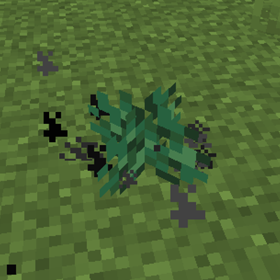

# Duskberry

> :tada:{ .mirror } ***DEDICATED CONTENT*** :tada:
>
> This feature is dedicated to DuskAdler (*Member 666*)

**Duskberry** is a post-Dragon trinket that grants increased Damage, Speed and Night Vision while held and curses player who eats it.

  

[TOC]

  <table id="kohara-infobox--item">
	<tr>
		<th colspan="2" class="kohara-infobox--top-image"></th>
	</tr>
	<tr>
		<th colspan="2">Info</th>
	</tr>
	<tr>
		<td><b>Tooltip</b></td>
		<td>Empowers your speed, sight and strength while held. Consuming or planting might have dire consequences  - Member #666 Item -<a class="footnote-ref" href="#fn:1">1</a></td>
	</tr>
</table>

## Obtaining
Duskberries can be found in Ships in [End Cities](../../structures/end_city.md), but only if they generate in [The Hallow](../../biomes/the_hallow.md). They can be found in <u>non-treasure</u> Chests at an oddly specific 57.14% chance.

## Usage

<figure class="kohara-side-image--right" markdown>
  { align=right width="200vw" .border }
  <figcaption>Planted Duskberry</figcaption>
</figure>
While holding a Duskberry in either main hand or off hand, players get +12% damage, +10% movement speed and +4% attack speed, on top of permanent Night Vision effect.

Eating a Duskberry curses the consumer, giving them Darkness, Slowness, Mining Fatigue, Weakness and Nausea for 36 seconds each. 

They can also be planted. Anything passing through the bush will be cursed with previous debuffs.

Duskberries can also be fed to Foxes. They won't be cursed, but poisoned instead, leaving them extremely vulnerable at 1:heart: x ₁/₂ HP.

## Tips
- Duskberries are extremely useful for getting `How Did We Get Here?` advancement due to sheer amount of debuffs it gives at once.
- Planted Duskberries inflict Blindness instead of Darkness.    
	- This was made due to an in-game bug that caused Area Effect Cloud with Darkness effect to not work properly.
- Planted Duskberries will never yield any fruits. However breaking the bush drops back 1 Duskberry.
- Duskberries can also be found in [Hallowed Crates](../../mechanics/void_fishing.md#crates), which is far easier than locating an End City in The Hallow.
- Duskberries are really versatile, fantastic both for combat (due to a 12% damage increase) as well as simple exploration (due to a 10% movement speed bonus). They are also perfect for caving because of permanent Night Vision.

## Trivia
<figure class="kohara-side-image--right" markdown>
  { align=right width=200px .border style="padding: 10px; margin: auto; image-rendering: pixelated;"}
  <figcaption>Old Duskberry sprite</figcaption>
</figure>

- Duskberries are said to taste like bismuth.
- Duskberries are a special item dedicated to DuskAdler for being 666th member to join kohara's Discord server.
- Their original color scheme used for this item was Dark Red, but Dusk didn't really like it, so it was changed to Otherwordly Purple instead.
- During development stage, Duskberry used to have a different texture than it has now. It resembled a berry more than the current one.

## Advancements
| Icon | Title | Description | Parent | Actual requirements (if different) | Resource Location |
| :--- | :--- | :--- | :--- | :--- | :--- |
| 
<i class="adv adv-task"></i><i class="icon-adv icon-stellarity icon-stellarity-duskberry"></i>
 | Don't Bush Your Luck! | Pick up a Duskberry from a chest in Hallow's End Ship | Husbandry | :x: | `stellarity:husbandry/duskberry/discover` |
| 
<i class="adv adv-challenge"></i><i class="icon-adv icon-stellarity icon-stellarity-duskberry"></i>
 | Poor Life Choices. | Eat, plant and feed a Fox a Duskberry | Don't Bush Your Luck! | :x: | `stellarity:husbandry/duskberry/poor_life_choices` |

## History
=== "**v2.0a**"
    - Speed bonus is now additive instead of multiplicative.
    - Night vision effect is now applied every 5 seconds rather than every tick.

=== "**vIndev-1.6a**"
	- Introduced.

[^1]: This part is written with Illageralt font, meaning that it is normally undecipherable