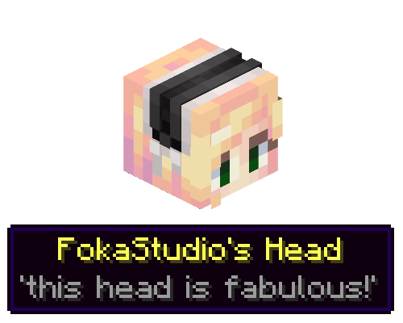
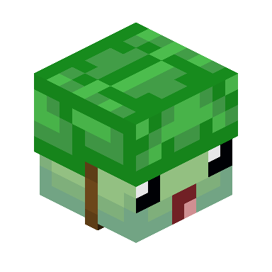
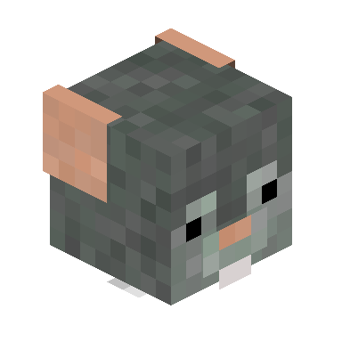
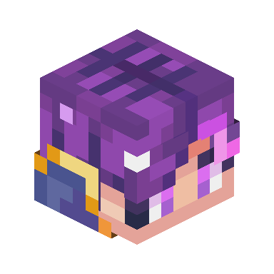
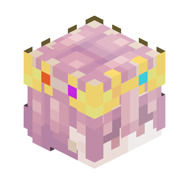

# Treasure Heads

!!! warning "This page uses many images! <i class="icon-minecraft icon-minecraft-painting"></i>"
    It is not recommended for people with limited or slow internet connections to read through this page.

**Treasure Heads** are special Player Heads rarely found inside Chests in [End Cities](../structures/end_city.md). They serve no purpose other than being nice collectibles.

There are currently 55 different Treasure Heads.

<figure markdown>
  { align=right .border }
  <figcaption>Example Treasure Head and its tooltip</figcaption>
</figure>

## Obtaining
As previously mentioned, Treasure Heads have a 25% chance to generate in either **Top Tower**, **Ship** or **Common** Chests found inside End Cities. Additionally, Treasure type Chests have a *66% chance* to contain *1 - 2* different Treasure Heads, with more generating dependant on player's Luck.

Additionally, all Crates found via [Void Fishing](void_fishing.md) can sometimes yield a Treasure Head as well.

## Usage
Treasure Heads serve no purpose other than being fun collectibles. 

### List of all current Treasure Heads
**NOTE: Multiple Heads belonging to the same player are merged into one table cell!**

| Texture | Player Name | Tooltip | Additional Notes |
| :--- | :--- | :--- | :--- |
| { width=64px } | ApolloDev | • 'Don't do worldgen, kids.' | :x: |
| { width=64px } | kohara_ | • 'downloading this pack was your last mistake' • 'nah, i'm feeling fabulous!' • 'hot furry boys... oh god i am drooling again' | Some text were changed throughout the development |
| { width=64px } | ArubikU | • 'Sometimes the code doesn't work' • 'The darkness is lighter' • 'Worship the great turtle god!' • 'Cooding is hard!?' | Has 4 Heads, even though the limit was 3 |
| { width=64px } | Devilcasters | • 'It must do something...' | :x: |
| { width=64px } | purejosh | • 'Can probably be found in his office, drinking a bougie coffee and creating a github ticket.' | :x: |
| { width=64px } | LinerRider | • 'We Ride The Lines' | :x: |
| { width=64px } | Jxsh_xx11 | • 'lover of thy mom' | :x: |
| { width=64px } | TurtelCult | • 'Holds the power and souls of all the Turtel Cult Members' | Cracked Head |
| { width=64px } | LabRat | • 'A starved volunteer for a certain youtuber' | Cracked Head |
| { width=64px } | IbzoRpun | • 'Shift 7' | Cracked Head |
| { width=64px } | Bush_King | • 'A beautiful plant is like having a friend around the house' | Cracked Head |
| { width=64px } | DuskAdler | • 'Plan 3 steps ahead of time' | Cracked Head |
| { width=64px } | p_yt | • '\*Insert Lore Here\*' • 'It is not stealing code if you change variable names!' • 'A mysterious head! Belongs to a developer, youtuber and LoL player' | :x: |
| { width=64px } | trikop | • 'Can't die if you're already dead yk- ;-;' | :x: |
| { width=64px } | TheRedmc_ | • 'Life is life, Creeper is death' • 'Gigachad timeee! | :x: |
| { width=64px } | css_scripter | • 'big holes *big holes* **big holes** **BIG HOLES** **B I G H O L E S**' | :x: |
| { width=64px } | IEatPotatoes_ | • 'this is a serious cry for help' • 'AHGSUHMWOMHIOCANIMC' • 'He only had 4K subs, all L’s, no dubs' | :x: |
| { width=64px } | cclack | • 'Throwing this in lava has a large chance of doing nothing' | :x: |
| { width=64px } | Hierol | • 'Meth... I mean moth :D' | :x: |
| { width=64px } | Mizuuwa | • 'Dont buy no weed from the gas station bro' | :x: |
| { width=64px } | SadlyBorger | • 'Look how they massacred ma boi Foka' | :x: |
| { width=64px } | MidasDaEpik | • 'Would you like to get burned alive?' | :x: |
| { width=64px } | _Quamsy | • 'Quam was here' | :x: |
| { width=64px } | Sylixa | • 'Moew~' | :x: |
| { width=64px } | Moood | • 'this pack is sponsored by church taxes' | :x: |
| { width=64px } | INQIZZO | • 'FSEEX?' • 'The best method of suicide is pinging starmute on discord' | :x: |
| { width=64px } | potato10l | • 'Wisdom always chased me but i was faster' | :x: |
| { width=64px } | Pailomots | • 'How did you find me?' | :x: |
| { width=64px } | catter1 | • 'Did someone say... salmon?' | :x: |
| { width=64px } | boyjob | • 'Why don't you make like an RPG and turn based?' | :x: |
| { width=64px } | MugLoved | • 'I used to rule the world, Chunks would load when I gave the Word!' | :x: |
| { width=64px } | DuckyDev_ | • 'Monke' | :x: |
| { width=64px } | jhens_ | • 'Exams! -.-' | :x: |
| { width=64px } | MoonLuna | • 'mom' | :x: |
| { width=64px } | KrunchyTaco | • 'mmm tacos' | :x: |
| { width=64px } | Azrotho | • 'Just a french guy, baguette.' | :x: |
| { width=64px } | Portal2001 | • 'The only boss of The End is the Dragon, all Heads you see are the players killed by it' | :x: |
| { width=64px } | MrBoopkins | • 'Kinda dating a frog' | :x: |
| { width=64px } | GreyTree06 | • 'Hello World!...End?' | :x: |
| { width=64px } | _Demi | • 'Buranyuu' | :x: |
| { width=64px } | Zichee | • 'I'M DYING AGHH, also why do i smell toasts?' | Always generates with TheTechnoFakerz' Head |
| { width=64px } | TheTechnoFakerz | • 'Are you dead yet , i need to eat toasts.' | Cracked Head Always generates with Zichee's Head |

## Trivia
- Before 2.0a, there used to be 105 Treasure Heads total, with some being borrowed from [Dungeon Now Loading](https://www.planetminecraft.com/data-pack/dungeon-now-loading-5-new-dungeons-5-new-bosses/) datapack.
- ArubikU currently has 4 Treasure Heads of theirs added into Stellarity, while the maximum number of submissions was 3.
    - This was due to kohara's oversight while counting, resulting in 4th Head being added. However, he decided not to remove it.
- Treasure Heads of TheTechnoFakerz and Zichee will always generate toghether in one Chest.
    - This was done per request of TheTechnoFakerz (Oreki) on Discord.
- Treasure Heads were first special mechanic added to Stellarity, dating back as far as version v1.1a.
    - Since their public release, they haven't been changed for almost a year, not until v2.0a and then v2.1a.

## Advancements
| Icon | Title | Description | Parent | Actual requirements (if different) | Resource Location |
| :--- | :--- | :--- | :--- | :--- | :--- |
| 
<i class="adv adv-goal"></i><i class="icon-adv icon-minecraft icon-minecraft-player-head"></i>
 | Treasure Room | Obtain a rare Treasure Head from a Chest in an End City. Can you find all 55? | Who's The Thief Now? | :x: | `stellarity:end_city/treasure_room` |
| 
<i class="adv adv-challenge"></i><i class="icon-adv icon-minecraft icon-minecraft-player-head"></i>
 | Headhunter | Find EVERY collectible Head | Treasure Room | Have every of the 55 Heads at least once in your inventory | `stellarity:end_city/treasure_room` |

## History
- **v2.0a**
    - Removed 105 previous Treasure Heads and replaced them with 55 new ones.
    - Reformatted loot table file used for drawing Treasure Heads.

- **v1.1a**
    - Introduced.
